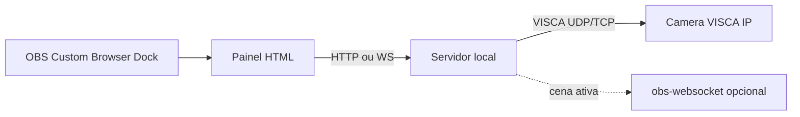

# Painel web PTZ no OBS (VISCA over IP)

**Sim, tem como.** Não precisa de plugin nativo. O [obs-ptz](https://github.com/glikely/obs-ptz) é C++/Qt com dock nativo, joystick, serial, ONVIF e integração profunda com cenas — isso é **difícil** (semanas/meses, toolchain OBS/Qt, CI Windows/macOS/Linux). Um **painel web** no OBS é **médio-fácil** para um MVP de pan/tilt/zoom/presets.

## Por que não copiar o obs-ptz

O plugin nativo usa `obs_frontend_add_dock`, Qt, hotkeys, associação source↔câmera e protocolos vários. Recriar isso em C++ só para ter UI web (CEF/`QCefWidget`) é o caminho **mais caro**.

O OBS já tem **Custom Browser Docks** (`Docks → Custom Browser Docks`): um Chromium embutido aponta para `http://localhost:...`. O browser **não** consegue falar VISCA (UDP/TCP) direto; precisa de um backend na máquina.

Padrão já usado por projetos como [OBS_PTZ_Camera_Control_Panel](https://github.com/Kees-van-der-Oord/OBS_PTZ_Camera_Control_Panel) (CGI) e [CamCtrlServer](https://github.com/craigkehl/CamCtrlServer) (VISCA + OBS).

## Dificuldade realista

- **UI no dock + mover câmera VISCA-IP:** 1–3 dias (joystick on-screen, hold-to-move, stop, zoom, 4–8 presets).
- **Várias câmeras, velocidade variável, config persistida:** mais alguns dias.
- **Trocar câmera automaticamente com a cena (como o obs-ptz):** precisa do [obs-websocket](https://github.com/obsproject/obs-websocket) (já vem no OBS recente). Extra, não bloqueia o MVP.
- **Serial, ONVIF, USB UVC, joystick físico, lock em Studio Mode:** fora do MVP; aí o nativo volta a fazer sentido.

Riscos típicos: porta/protocolo (UDP `52381` Sony vs TCP `5678` em muitas câmeras chinesas), sequence number VISCA-IP, CORS (same origin no servidor), hold-to-move precisa de `stop` confiável no `mouseup`/`touchend`.

## MVP proposto

Stack enxuta:

- Backend **Node**: servir o painel + API; socket UDP/TCP VISCA.
- Frontend estático: pad, zoom, presets, seletor de câmera, campos IP/porta/protocolo.
- Sem plugin C++, sem CMake, sem Qt.

Comandos VISCA mínimos: `PanTiltDrive` (direções + stop), `CamZoom` (tele/wide/stop), `Memory Recall/Set`. Envelope VISCA over IP (`payload type` + sequence) quando for UDP Sony-style.

API sugerida: `POST /api/ptz/move` `{dir, speed}`, `POST /api/ptz/zoom`, `POST /api/ptz/stop`, `POST /api/ptz/preset/{id}`, `GET/PUT /api/cameras`.

Uso: subir o servidor → no OBS adicionar dock `http://127.0.0.1:PORT` → o mesmo URL também abre no tablet na LAN (controle remoto), o que o dock Qt do obs-ptz não dá de graça.

## Fora deste MVP

Fork do obs-ptz, hotkeys nativas, joystick SDL, ONVIF, empacotar `.dll`/`.plugin`. Pode vir depois se o painel web ficar curto.

## Verificação

Testar contra a câmera real (ou simulador VISCA se não estiver no ar). No OBS: dock visível, hold no pad move e soltar para, preset recall.

## Status de implementação

- [x] Plano documentado
- [x] Servidor local + UI web
- [x] VISCA over IP (UDP/TCP)
- [x] Documentação do Custom Browser Dock
- [ ] obs-websocket (opcional)
